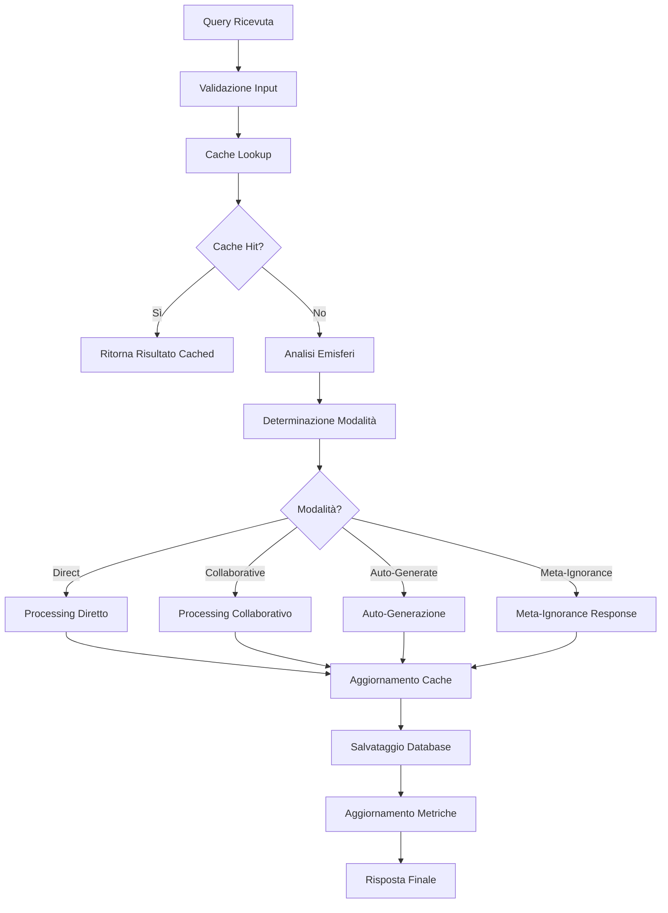

# Documentazione Tecnica - AGI Meta-Ignorance Backend

## Indice

1. [Architettura del Sistema](#architettura-del-sistema)
2. [Componenti Core](#componenti-core)
3. [Flusso di Elaborazione](#flusso-di-elaborazione)
4. [Database Schema](#database-schema)
5. [API Specification](#api-specification)
6. [Algoritmi e Logica](#algoritmi-e-logica)
7. [Performance e Scalabilità](#performance-e-scalabilità)
8. [Sicurezza](#sicurezza)
9. [Troubleshooting](#troubleshooting)

## Architettura del Sistema

### Panoramica Architetturale

Il sistema AGI Meta-Ignorance è costruito seguendo un'architettura modulare a microservizi interni, dove ogni componente ha responsabilità specifiche e ben definite. L'architettura è progettata per essere scalabile, mantenibile e facilmente estensibile.

```
┌─────────────────────────────────────────────────────────────┐
│                    AGI Backend System                       │
├─────────────────────────────────────────────────────────────┤
│  ┌─────────────┐  ┌─────────────┐  ┌─────────────┐         │
│  │   Express   │  │    CORS     │  │Rate Limiter │         │
│  │   Server    │  │ Middleware  │  │ Middleware  │         │
│  └─────────────┘  └─────────────┘  └─────────────┘         │
├─────────────────────────────────────────────────────────────┤
│                    API Layer                                │
│  ┌─────────────┐  ┌─────────────┐  ┌─────────────┐         │
│  │   Queries   │  │ Hemispheres │  │   Metrics   │         │
│  │   Routes    │  │   Routes    │  │   Routes    │         │
│  └─────────────┘  └─────────────┘  └─────────────┘         │
├─────────────────────────────────────────────────────────────┤
│                   Core AGI Layer                            │
│  ┌─────────────────────────────────────────────────────────┐ │
│  │         MetaIgnoranceOrchestrator                       │ │
│  │  ┌─────────────┐  ┌─────────────┐  ┌─────────────┐     │ │
│  │  │ Hemisphere  │  │ Hemisphere  │  │ Hemisphere  │     │ │
│  │  │ Mathematics │  │    Logic    │  │    Code     │     │ │
│  │  └─────────────┘  └─────────────┘  └─────────────┘     │ │
│  │  ┌─────────────┐  ┌─────────────┐                      │ │
│  │  │ Hemisphere  │  │ Hemisphere  │                      │ │
│  │  │  Factory    │  │   Cache     │                      │ │
│  │  └─────────────┘  └─────────────┘                      │ │
│  └─────────────────────────────────────────────────────────┘ │
├─────────────────────────────────────────────────────────────┤
│                 Resource Management                         │
│  ┌─────────────┐  ┌─────────────┐  ┌─────────────┐         │
│  │  Resource   │  │ Performance │  │   Memory    │         │
│  │  Manager    │  │  Metrics    │  │ Monitoring  │         │
│  └─────────────┘  └─────────────┘  └─────────────┘         │
├─────────────────────────────────────────────────────────────┤
│                   Data Layer                                │
│  ┌─────────────┐  ┌─────────────┐  ┌─────────────┐         │
│  │   SQLite    │  │   Backup    │  │   Cache     │         │
│  │  Database   │  │   System    │  │   Layer     │         │
│  └─────────────┘  └─────────────┘  └─────────────┘         │
└─────────────────────────────────────────────────────────────┘
```

### Principi Architetturali

1. **Separazione delle Responsabilità**: Ogni componente ha un ruolo specifico e ben definito
2. **Modularità**: I componenti sono intercambiabili e testabili indipendentemente
3. **Scalabilità**: L'architettura supporta l'aggiunta di nuovi emisferi e funzionalità
4. **Resilienza**: Il sistema continua a funzionare anche in caso di fallimento di singoli componenti
5. **Osservabilità**: Monitoraggio completo di tutte le operazioni e metriche

## Componenti Core

### MetaIgnoranceOrchestrator

Il MetaIgnoranceOrchestrator è il componente centrale che coordina tutte le operazioni del sistema AGI.

#### Responsabilità Principali

- **Query Routing**: Determina quale emisfero o combinazione di emisferi dovrebbe processare una query
- **Meta-Ignorance Detection**: Identifica quando il sistema non ha conoscenze sufficienti
- **Auto-Generation Coordination**: Coordina la creazione di nuovi emisferi quando necessario
- **Performance Monitoring**: Traccia le performance di tutte le operazioni

#### Modalità di Processing

1. **Direct Mode**: Query processata da un singolo emisfero con alta confidenza
2. **Collaborative Mode**: Query processata da multiple emisferi che collaborano
3. **Auto-Generation Mode**: Creazione di nuovo emisfero per gestire la query
4. **Meta-Ignorance Mode**: Riconoscimento esplicito dei limiti di conoscenza

#### Algoritmo di Decisione

```javascript
function determineProcessingMode(hemisphereAnalysis) {
  const maxConfidence = Math.max(...hemisphereAnalysis.map(h => h.confidence));
  const highConfidenceCount = hemisphereAnalysis.filter(h => 
    h.confidence > CONFIDENCE_THRESHOLD).length;
  
  if (maxConfidence >= CONFIDENCE_THRESHOLD) {
    return highConfidenceCount > 1 ? 'collaborative' : 'direct';
  } else if (maxConfidence > META_IGNORANCE_THRESHOLD) {
    return AUTO_GENERATION_ENABLED ? 'auto_generate' : 'meta_ignorance';
  } else {
    return 'meta_ignorance';
  }
}
```

### Hemisphere

Gli emisferi rappresentano domini di conoscenza specializzati, ognuno con competenze specifiche.

#### Struttura Interna

```javascript
class Hemisphere {
  constructor(domain, config) {
    this.id = uuidv4();
    this.domain = domain;
    this.knowledgeBase = new Map();
    this.patterns = [];
    this.confidence = 0.5;
    this.metadata = {
      autoGenerated: false,
      specialization: 'general',
      parentDomain: null
    };
  }
}
```

#### Processo di Analisi

1. **Tokenization**: Scomposizione della query in token
2. **Pattern Matching**: Verifica corrispondenza con pattern noti
3. **Knowledge Base Lookup**: Ricerca nella base di conoscenza
4. **Confidence Calculation**: Calcolo della confidenza basato su multiple metriche

#### Apprendimento Adattivo

Gli emisferi apprendono dalle interazioni attraverso:
- Aggiornamento della knowledge base con nuove informazioni
- Raffinamento dei pattern di riconoscimento
- Aggiustamento dei pesi di confidenza

### HemisphereFactory

La HemisphereFactory è responsabile della creazione intelligente di nuovi emisferi.

#### Template di Domini

```javascript
const domainTemplates = {
  'physics': {
    keywords: ['physics', 'quantum', 'mechanics', 'energy'],
    patterns: [/physics|quantum|mechanics/i],
    specialization: 'science',
    confidence: 0.7
  },
  'biology': {
    keywords: ['biology', 'cell', 'organism', 'dna'],
    patterns: [/biology|cell|organism|dna/i],
    specialization: 'science',
    confidence: 0.7
  }
  // ... altri template
};
```

#### Algoritmo di Generazione

1. **Domain Analysis**: Analisi della query per identificare potenziali domini
2. **Template Matching**: Confronto con template predefiniti
3. **Confidence Evaluation**: Valutazione della confidenza per la generazione
4. **Hemisphere Creation**: Creazione e configurazione del nuovo emisfero
5. **Integration**: Integrazione nel sistema esistente

### ResourceManager

Il ResourceManager monitora e ottimizza l'utilizzo delle risorse di sistema.

#### Metriche Monitorate

- **Memoria**: Heap usage, system memory, garbage collection
- **CPU**: Load average, process CPU usage
- **Cache**: Hit rate, size, performance
- **Database**: Query performance, connection pool

#### Ottimizzazioni Automatiche

- **Garbage Collection**: Esecuzione automatica quando necessario
- **Cache Cleanup**: Pulizia automatica della cache quando piena
- **Memory Management**: Monitoraggio e allerta per utilizzo memoria
- **Performance Tuning**: Aggiustamenti automatici dei parametri

## Flusso di Elaborazione

### Ciclo di Vita di una Query



### Processo di Auto-Generazione

1. **Gap Detection**: Identificazione di gap di conoscenza nella query
2. **Domain Identification**: Identificazione di potenziali nuovi domini
3. **Template Selection**: Selezione del template più appropriato
4. **Hemisphere Creation**: Creazione del nuovo emisfero
5. **Knowledge Initialization**: Inizializzazione con conoscenze base
6. **System Integration**: Integrazione nel sistema esistente
7. **Query Reprocessing**: Riprocessamento della query originale

## Database Schema

### Tabelle Principali

#### hemispheres
```sql
CREATE TABLE hemispheres (
  id TEXT PRIMARY KEY,
  domain TEXT UNIQUE NOT NULL,
  created_at DATETIME DEFAULT CURRENT_TIMESTAMP,
  last_used DATETIME DEFAULT CURRENT_TIMESTAMP,
  usage_count INTEGER DEFAULT 0,
  confidence REAL DEFAULT 0.5,
  knowledge_base TEXT, -- JSON
  patterns TEXT, -- JSON array
  metadata TEXT, -- JSON
  config TEXT, -- JSON
  serialized_data TEXT -- JSON completo
);
```

#### queries
```sql
CREATE TABLE queries (
  id TEXT PRIMARY KEY,
  query_text TEXT NOT NULL,
  query_hash TEXT,
  timestamp DATETIME DEFAULT CURRENT_TIMESTAMP,
  processing_time INTEGER,
  success BOOLEAN,
  confidence REAL,
  processing_mode TEXT,
  primary_hemisphere TEXT,
  collaborating_hemispheres TEXT, -- JSON array
  response TEXT, -- JSON
  metadata TEXT -- JSON
);
```

#### performance_metrics
```sql
CREATE TABLE performance_metrics (
  id INTEGER PRIMARY KEY AUTOINCREMENT,
  timestamp DATETIME DEFAULT CURRENT_TIMESTAMP,
  operation TEXT NOT NULL,
  duration INTEGER NOT NULL,
  success BOOLEAN NOT NULL,
  metadata TEXT, -- JSON
  hemisphere_id TEXT,
  query_id TEXT
);
```

#### knowledge_gaps
```sql
CREATE TABLE knowledge_gaps (
  id INTEGER PRIMARY KEY AUTOINCREMENT,
  query_text TEXT NOT NULL,
  query_hash TEXT,
  timestamp DATETIME DEFAULT CURRENT_TIMESTAMP,
  gap_type TEXT NOT NULL,
  severity REAL,
  tokens TEXT, -- JSON array
  hemisphere_confidences TEXT, -- JSON
  suggestions TEXT, -- JSON array
  resolved BOOLEAN DEFAULT FALSE
);
```

### Indici per Performance

```sql
-- Indici per query frequenti
CREATE INDEX idx_hemispheres_domain ON hemispheres(domain);
CREATE INDEX idx_hemispheres_last_used ON hemispheres(last_used);
CREATE INDEX idx_queries_timestamp ON queries(timestamp);
CREATE INDEX idx_queries_hash ON queries(query_hash);
CREATE INDEX idx_performance_timestamp ON performance_metrics(timestamp);
CREATE INDEX idx_knowledge_gaps_type ON knowledge_gaps(gap_type);

-- Indici compositi per query complesse
CREATE INDEX idx_queries_mode_success ON queries(processing_mode, success);
CREATE INDEX idx_performance_operation_success ON performance_metrics(operation, success);
```

## API Specification

### Autenticazione e Autorizzazione

Il sistema utilizza rate limiting per proteggere le API:

```javascript
const rateLimiter = new RateLimiterMemory({
  keyGenerator: (req) => req.ip,
  points: 100, // Numero di richieste
  duration: 900, // 15 minuti
});
```

### Endpoints Dettagliati

#### POST /api/v1/queries

Processa una nuova query attraverso il sistema AGI.

**Request Body:**
```json
{
  "query": "string (required, 1-5000 chars)",
  "options": {
    "timeout": "number (optional, 1000-60000ms)",
    "cacheEnabled": "boolean (optional)",
    "mode": "string (optional: auto|direct|collaborative|meta_ignorance)",
    "preferredHemisphere": "string (optional)"
  }
}
```

**Response:**
```json
{
  "success": "boolean",
  "query": "string",
  "response": "object",
  "confidence": "number (0-1)",
  "mode": "string",
  "processingTime": "number (ms)",
  "metadata": {
    "requestId": "string",
    "timestamp": "string (ISO)",
    "hemisphereAnalysis": "array"
  },
  "knowledgeGaps": "array (optional)",
  "suggestions": "array (optional)",
  "newHemisphere": "string (optional)"
}
```

#### GET /api/v1/hemispheres

Ottiene la lista di tutti gli emisferi attivi.

**Query Parameters:**
- `stats`: boolean - Include statistiche dettagliate
- `sort`: string - Campo per ordinamento (domain, confidence, usageCount)
- `order`: string - Direzione ordinamento (asc, desc)

**Response:**
```json
{
  "hemispheres": [
    {
      "id": "string",
      "domain": "string",
      "createdAt": "string (ISO)",
      "lastUsed": "string (ISO)",
      "usageCount": "number",
      "confidence": "number",
      "knowledgeItems": "number",
      "patterns": "number",
      "metadata": "object"
    }
  ],
  "total": "number",
  "metadata": "object"
}
```

#### GET /api/v1/system/health

Verifica lo stato di salute del sistema.

**Response:**
```json
{
  "status": "string (healthy|degraded|unhealthy)",
  "timestamp": "string (ISO)",
  "checks": [
    {
      "component": "string",
      "status": "string",
      "message": "string",
      "warnings": "array (optional)",
      "errors": "array (optional)"
    }
  ],
  "uptime": "number (seconds)",
  "version": "string"
}
```

### Error Handling

Tutti gli errori seguono un formato standardizzato:

```json
{
  "error": "string (error type)",
  "message": "string (human readable)",
  "requestId": "string",
  "timestamp": "string (ISO)",
  "stack": "string (development only)"
}
```

**Codici di Stato HTTP:**
- `200`: Successo
- `400`: Bad Request (errore validazione)
- `404`: Not Found
- `429`: Too Many Requests (rate limit)
- `500`: Internal Server Error
- `503`: Service Unavailable

## Algoritmi e Logica

### Algoritmo di Confidenza

La confidenza di un emisfero per una query è calcolata usando multiple metriche:

```javascript
function calculateConfidence(query, hemisphere) {
  let confidence = 0;
  
  // Pattern matching (peso: 40%)
  const patternScore = calculatePatternScore(query, hemisphere.patterns);
  confidence += patternScore * 0.4;
  
  // Knowledge base relevance (peso: 35%)
  const knowledgeScore = calculateKnowledgeScore(query, hemisphere.knowledgeBase);
  confidence += knowledgeScore * 0.35;
  
  // Historical performance (peso: 15%)
  const historyScore = calculateHistoryScore(hemisphere);
  confidence += historyScore * 0.15;
  
  // Domain specialization (peso: 10%)
  const specializationScore = calculateSpecializationScore(query, hemisphere.metadata);
  confidence += specializationScore * 0.1;
  
  return Math.min(confidence, 1.0);
}
```

### Algoritmo di Meta-Ignorance

Il sistema identifica gap di conoscenza attraverso:

```javascript
function identifyKnowledgeGaps(query, hemisphereAnalysis) {
  const gaps = [];
  
  // Analizza token non riconosciuti
  const tokens = tokenize(query);
  const recognizedTokens = new Set();
  
  hemisphereAnalysis.forEach(analysis => {
    analysis.tokens.forEach(token => recognizedTokens.add(token));
  });
  
  const unrecognizedTokens = tokens.filter(token => !recognizedTokens.has(token));
  
  if (unrecognizedTokens.length > 0) {
    gaps.push({
      type: 'vocabulary',
      tokens: unrecognizedTokens,
      severity: unrecognizedTokens.length / tokens.length
    });
  }
  
  // Analizza confidenza generale
  const maxConfidence = Math.max(...hemisphereAnalysis.map(h => h.confidence));
  if (maxConfidence < META_IGNORANCE_THRESHOLD) {
    gaps.push({
      type: 'domain_knowledge',
      confidence: maxConfidence,
      severity: 1 - maxConfidence
    });
  }
  
  return gaps;
}
```

### Algoritmo di Cache

Il sistema implementa una cache LRU (Least Recently Used) con TTL:

```javascript
class IntelligentCache {
  constructor(maxSize, ttl) {
    this.cache = new Map();
    this.maxSize = maxSize;
    this.ttl = ttl;
  }
  
  get(key) {
    const item = this.cache.get(key);
    if (!item) return null;
    
    // Verifica TTL
    if (Date.now() - item.timestamp > this.ttl) {
      this.cache.delete(key);
      return null;
    }
    
    // Aggiorna posizione (LRU)
    this.cache.delete(key);
    this.cache.set(key, item);
    
    return item.value;
  }
  
  set(key, value) {
    // Rimuovi elementi vecchi se necessario
    if (this.cache.size >= this.maxSize) {
      const firstKey = this.cache.keys().next().value;
      this.cache.delete(firstKey);
    }
    
    this.cache.set(key, {
      value,
      timestamp: Date.now()
    });
  }
}
```

## Performance e Scalabilità

### Metriche di Performance Target

- **Latenza**: < 500ms per il 95% delle query
- **Throughput**: > 100 query/secondo
- **Memoria**: < 512MB per setup base
- **CPU**: < 50% utilizzo medio

### Strategie di Ottimizzazione

#### 1. Caching Multi-Livello

```javascript
// L1: In-memory cache per query frequenti
const queryCache = new Map();

// L2: Hemisphere cache per emisferi utilizzati di recente
const hemisphereCache = new Map();

// L3: Database query cache
const dbCache = new Map();
```

#### 2. Connection Pooling

```javascript
class DatabasePool {
  constructor(maxConnections = 10) {
    this.pool = [];
    this.maxConnections = maxConnections;
    this.activeConnections = 0;
  }
  
  async getConnection() {
    if (this.pool.length > 0) {
      return this.pool.pop();
    }
    
    if (this.activeConnections < this.maxConnections) {
      this.activeConnections++;
      return await this.createConnection();
    }
    
    // Attendi connessione disponibile
    return await this.waitForConnection();
  }
}
```

#### 3. Lazy Loading

Gli emisferi vengono caricati solo quando necessari:

```javascript
async function loadHemisphere(domain) {
  if (this.hemisphereCache.has(domain)) {
    return this.hemisphereCache.get(domain);
  }
  
  const hemisphereData = await this.database.getHemisphereByDomain(domain);
  const hemisphere = Hemisphere.deserialize(hemisphereData);
  
  this.hemisphereCache.set(domain, hemisphere);
  return hemisphere;
}
```

### Scalabilità Orizzontale

Il sistema è progettato per supportare scalabilità orizzontale attraverso:

1. **Stateless Design**: Nessuno stato condiviso tra istanze
2. **Database Sharding**: Possibilità di dividere i dati su multiple istanze
3. **Load Balancing**: Distribuzione del carico tra multiple istanze
4. **Microservices**: Possibilità di separare componenti in servizi indipendenti

## Sicurezza

### Misure di Sicurezza Implementate

#### 1. Input Validation

```javascript
const querySchema = Joi.object({
  query: Joi.string().required().min(1).max(5000),
  options: Joi.object({
    timeout: Joi.number().integer().min(1000).max(60000),
    cacheEnabled: Joi.boolean(),
    mode: Joi.string().valid('auto', 'direct', 'collaborative', 'meta_ignorance')
  }).optional()
});
```

#### 2. Rate Limiting

```javascript
const rateLimiter = new RateLimiterMemory({
  keyGenerator: (req) => req.ip,
  points: 100, // Richieste per finestra
  duration: 900, // 15 minuti
});
```

#### 3. Error Sanitization

```javascript
function sanitizeError(error, isDevelopment) {
  const sanitized = {
    error: error.name || 'Internal Server Error',
    message: error.message || 'An unexpected error occurred',
    requestId: req.id,
    timestamp: new Date().toISOString()
  };
  
  if (isDevelopment) {
    sanitized.stack = error.stack;
  }
  
  return sanitized;
}
```

#### 4. CORS Configuration

```javascript
app.use(cors({
  origin: process.env.CORS_ORIGIN || '*',
  methods: ['GET', 'POST', 'PUT', 'DELETE', 'OPTIONS'],
  allowedHeaders: ['Content-Type', 'Authorization', 'X-Requested-With'],
  credentials: true
}));
```

### Best Practices di Sicurezza

1. **Principio del Minimo Privilegio**: Ogni componente ha solo i permessi necessari
2. **Defense in Depth**: Multiple layer di sicurezza
3. **Fail Secure**: In caso di errore, il sistema fallisce in modo sicuro
4. **Audit Logging**: Log completi di tutte le operazioni sensibili
5. **Regular Updates**: Aggiornamenti regolari delle dipendenze

## Troubleshooting

### Problemi Comuni e Soluzioni

#### 1. High Memory Usage

**Sintomi:**
- Utilizzo memoria > 80%
- Performance degradate
- Garbage collection frequente

**Soluzioni:**
```bash
# Verifica utilizzo memoria
curl http://localhost:3000/api/v1/metrics/system

# Forza garbage collection
curl -X POST http://localhost:3000/api/v1/system/gc

# Pulisci cache
curl -X POST http://localhost:3000/api/v1/admin/cache/clear
```

#### 2. Database Lock Issues

**Sintomi:**
- Timeout nelle query database
- Errori "database is locked"

**Soluzioni:**
```bash
# Verifica connessioni attive
node -e "
const db = require('./src/database/SQLiteManager');
console.log('Active connections:', db.activeConnections);
"

# Restart del servizio
pm2 restart agi-backend
```

#### 3. High Response Times

**Sintomi:**
- Tempo di risposta > 1000ms
- Timeout delle query

**Soluzioni:**
```bash
# Analizza performance metrics
curl http://localhost:3000/api/v1/metrics/performance

# Verifica cache hit rate
curl http://localhost:3000/api/v1/metrics | jq '.system.cache'

# Ottimizza database
node src/database/migrate.js migrate
```

#### 4. Auto-Generation Failures

**Sintomi:**
- Nuovi emisferi non vengono creati
- Errori nella HemisphereFactory

**Soluzioni:**
```bash
# Verifica configurazione
curl http://localhost:3000/api/v1/system/config

# Test manuale generazione
curl -X POST http://localhost:3000/api/v1/hemispheres/generate \
  -H "Content-Type: application/json" \
  -d '{"query": "test query", "force": true}'

# Verifica log errori
curl http://localhost:3000/api/v1/admin/logs?severity=error
```

### Log Analysis

#### Livelli di Log

- **ERROR**: Errori critici che richiedono attenzione immediata
- **WARN**: Situazioni anomale ma non critiche
- **INFO**: Informazioni generali sulle operazioni
- **DEBUG**: Informazioni dettagliate per debugging

#### Query di Log Utili

```bash
# Errori recenti
curl "http://localhost:3000/api/v1/admin/logs?severity=error&hours=24"

# Performance issues
curl "http://localhost:3000/api/v1/metrics/performance?hours=1" | \
  jq '.database.metrics[] | select(.duration > 1000)'

# Cache performance
curl "http://localhost:3000/api/v1/metrics" | \
  jq '.system.cache'
```

### Monitoring e Alerting

#### Metriche da Monitorare

1. **Response Time**: Tempo medio di risposta
2. **Error Rate**: Percentuale di errori
3. **Memory Usage**: Utilizzo memoria
4. **CPU Usage**: Utilizzo CPU
5. **Cache Hit Rate**: Efficacia della cache
6. **Database Performance**: Performance delle query database

#### Setup Alerting

```javascript
// Esempio configurazione alert
const alerts = {
  highResponseTime: {
    threshold: 1000, // ms
    action: 'email_admin'
  },
  highErrorRate: {
    threshold: 0.05, // 5%
    action: 'slack_notification'
  },
  highMemoryUsage: {
    threshold: 0.9, // 90%
    action: 'auto_restart'
  }
};
```

---

Questa documentazione tecnica fornisce una panoramica completa del sistema AGI Meta-Ignorance Backend. Per ulteriori dettagli su specifici componenti o funzionalità, consultare il codice sorgente e i commenti inline.

